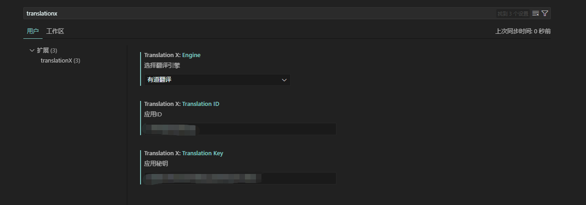

# 插件说明

## 特性

### 配置

在设置中搜索`translationx`，目前**仅支持有道翻译**，自行去有道翻译官网注册账号，获取`appKey`和`appSecret`，填入设置中即可

### 使用说明

#### 翻译选中文本

1、选中文本，鼠标右键点击“翻译”，即可在编辑器底部看到翻译结果

2、目前仅支持中译英及英译中，其他语言后续可支持配置

#### 翻译并替换选中文本

1、选中文本，鼠标右键点击“翻译并替换”，即可在编辑器中看到翻译结果

2、目前仅支持中译英及英译中，其他语言后续可支持配置

