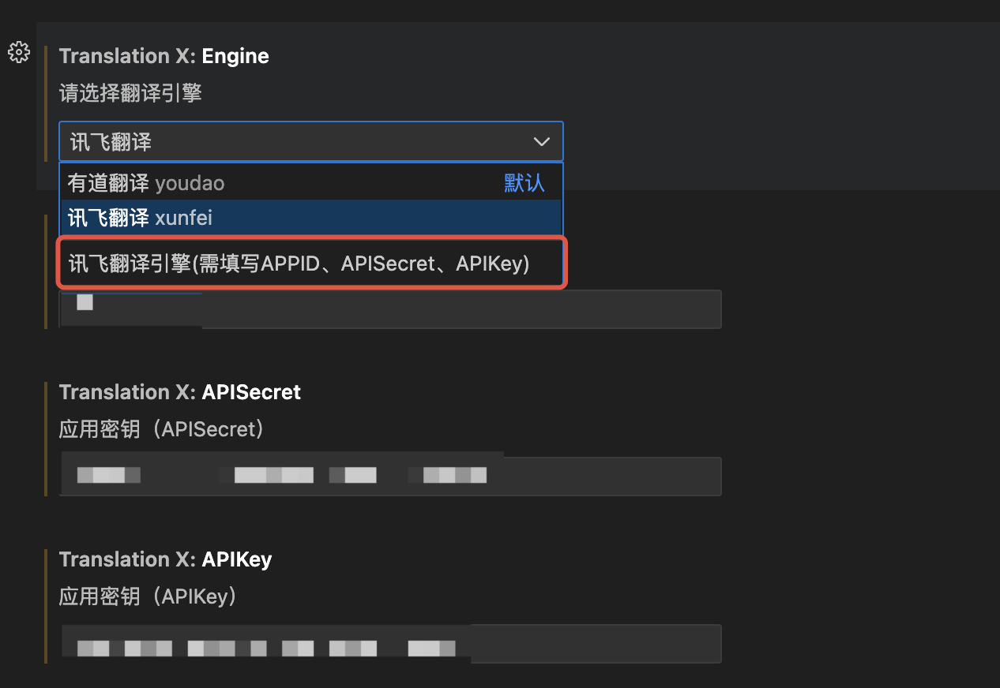

# 插件说明

> 本项目开源，方便的话给个star支持下，谢谢
> https://github.com/Saraph1nes/vscode-transX

## 特性

提供仅翻译和翻译并替换两种功能，支持中、英互转

目前已支持有道翻译和讯飞AI翻译，自己申请API账号再配置即可

- 有道翻译：https://ai.youdao.com/console/#/
- 讯飞开放平台：https://console.xfyun.cn/app/myapp

### 配置

如图配置即可，注意填写的准确性

### 使用说明

#### 翻译选中文本

1、选中文本，鼠标右键点击“翻译”，即可在编辑器底部看到翻译结果

2、目前仅支持中译英及英译中，其他语言后续可支持配置

#### 翻译并替换选中文本

1、选中文本，鼠标右键点击“翻译并替换”，即可在编辑器中看到翻译结果

2、目前仅支持中、英互译，其他语言后续可支持配置

